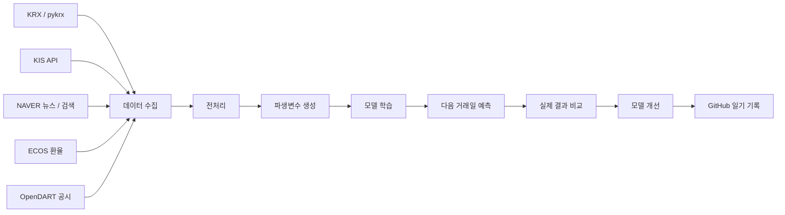
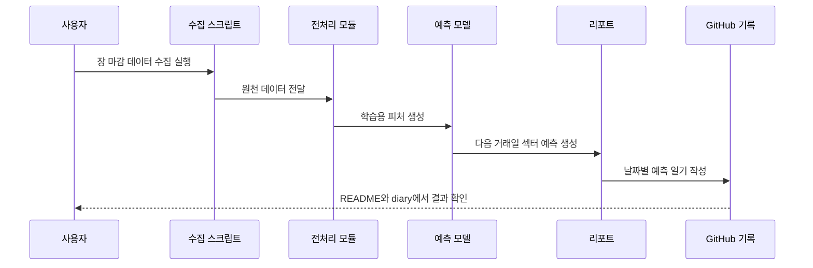

# 파트 예측: 국내 주식 섹터 상승 예측 프로젝트

국내 주식시장의 가격, 거래대금, 뉴스, 검색 관심도, 환율, 장중 흐름을 수집해  
**다음 거래일에 상대적으로 강할 가능성이 높은 섹터를 예측하는 머신러닝 프로젝트**입니다.

이 프로젝트는 개별 종목을 바로 예측하기보다, 먼저 시장을 섹터 단위로 해석합니다.  
즉 “내일 어떤 종목이 오를까?”보다 먼저 *“내일 어느 분야가 강할 가능성이 높은가?”*를 판단하는 것을 목표로 합니다.

---

## 프로젝트 핵심 요약

| 항목 | 내용 |
|---|---|
| 문제 정의 | 다음 거래일 국내 주식시장에서 강세 가능성이 높은 섹터 예측 |
| 예측 단위 | 개별 종목이 아닌 섹터 |
| 주요 데이터 | KRX, KIS, NAVER 뉴스/검색, ECOS, OpenDART |
| 모델 방식 | 머신러닝 기반 상승 여부, 기대수익률, 관찰 등급 예측 |
| 산출물 | 섹터 예측표, 장중 반등 신호, 예측 검증 일기 |
| 기록 방식 | README 요약 + `docs/diary/` 날짜별 상세 기록 |

---

## 프로젝트를 만든 이유

주식시장은 개별 종목보다 섹터 단위로 먼저 움직이는 경우가 많습니다.  
특히 뉴스, 정책, 수급, 환율, 거래대금 변화는 특정 종목 하나보다 **산업군 전체의 방향성**에 먼저 영향을 줄 수 있습니다.

그래서 이 프로젝트는 다음 흐름으로 접근합니다.

1. 시장 전체 분위기와 거래일 상태를 확인합니다.
2. 섹터별 가격, 거래대금, 뉴스, 검색 관심도, 장중 흐름을 수집합니다.
3. 상승 가능성, 기대수익률, 관찰 등급을 예측합니다.
4. 다음 거래일 실제 결과와 비교해 모델을 개선합니다.
5. 개선 과정과 판단 근거를 GitHub 일기 형식으로 기록합니다.

---

## 전체 파이프라인

---

## 데이터 수집 구조

| 데이터 | 활용 목적 |
|---|---|
| KRX / pykrx | 일별 주가, 거래대금, 시장 기준 데이터 수집 |
| KIS API | 장중 현재가와 실시간 섹터 흐름 수집 |
| NAVER 뉴스 | 섹터별 이슈와 기대감 반영 |
| NAVER DataLab | 검색 관심도와 FOMO 흐름 반영 |
| ECOS | 환율 등 거시경제 변수 반영 |
| OpenDART | 기업 공시 이벤트 확인 |

수집 단계에서는 주말, 휴장일, API 장애, 중복 날짜 수집 문제를 줄이기 위해  
시장 캘린더 제어 변수와 데이터 상태값을 함께 관리합니다.

---

## 모델이 예측하는 것

현재 모델은 딥러닝이 아닌 **머신러닝 기반 섹터 예측 모델**입니다.

| 예측 질문 | 설명 |
|---|---|
| 이 섹터가 내일 상승할 가능성이 있는가? | 상승 확률 예측 |
| 상승한다면 어느 정도 기대할 수 있는가? | 기대수익률 예측 |
| 실제 관찰 후보로 볼 만한가? | 확률, 거래대금, 변동성, 장중 흐름을 종합해 등급화 |

모델은 단순히 상승 여부만 출력하지 않고,  
섹터별 관찰 우선순위와 리스크를 함께 보여주도록 구성했습니다.

---

## 주요 파생변수

| 변수 그룹 | 설명 |
|---|---|
| 시장 캘린더 변수 | 거래일, 휴장일, 다음 거래일 여부 |
| 가격 흐름 변수 | 일별 수익률, 장중 수익률, 전일 대비 변화 |
| 거래대금 변수 | 섹터별 거래대금, 거래대금 집중도 |
| FOMO 변수 | 뉴스량, 검색 관심도, 관심도 급증 여부 |
| 리스크 변수 | 변동성, 급락 여부, 과열 여부 |
| 검증 변수 | 예측 결과와 실제 결과의 일치 여부 |

---

## 예측 결과 예시

| 순위 | 섹터 | 상승 확률 | 기대수익률 | 판단 |
|---|---:|---:|---:|---|
| 1 | 자동차 | 69.5% | +1.76% | 강한 관찰 후보 |
| 2 | 반도체/전자 | 74.8% | +1.63% | 강한 관찰 후보 |
| 3 | 금융 | 67.0% | +1.68% | 주요 관찰 후보 |

최신 예측 결과는 `reports/tomorrow_sector_prediction.csv`와  
`reports/daily_portfolio_advisor.csv`에서 확인할 수 있습니다.

---

## 예측 검증 방식

예측은 단순히 맞고 틀림으로 끝내지 않습니다.  
매일 실제 결과와 비교해 어떤 변수가 효과적이었는지, 어떤 부분을 놓쳤는지 기록합니다.

| 검증 항목 | 설명 |
|---|---|
| 방향 정확도 | 상승 예측 섹터가 실제로 상승했는지 확인 |
| Top N 적중률 | 예측 상위 섹터가 실제 강세 섹터에 포함됐는지 확인 |
| 순위 변화 | 예측 순위와 실제 강세 순위 비교 |
| 실패 원인 | 뉴스 과열, 장중 반전, 거래대금 왜곡 여부 분석 |
| 개선 기록 | 다음 학습에 반영할 변수와 전처리 기준 정리 |

---

## 해결한 문제와 개선 기록

| 날짜 | 문제 | 개선 내용 |
|---|---|---|
| 2026-06-03 | 휴장일에도 데이터가 중복 수집되는 문제 | 거래일 캘린더 제어 변수 추가 |
| 2026-06-04 | 결측치와 이상치 처리 기준이 불명확한 문제 | 전처리 기준 분리 |
| 2026-06-05 | 장중 데이터가 stale 상태로 남는 문제 | KIS 실패 감지와 fallback 구조 점검 |
| 2026-06-08 | 일별 기록 구조가 분산되는 문제 | `docs/diary/` 날짜별 기록 방식으로 정리 |
| 2026-06-12 | GitHub 포트폴리오 가독성 부족 | README, Notebook, Mermaid 기반 구조 개선 |

---

## 실행 흐름

---

## 주요 결과물

| 파일 | 설명 |
|---|---|
| `reports/tomorrow_sector_prediction.csv` | 다음 거래일 섹터 예측 결과 |
| `reports/daily_portfolio_advisor.csv` | 섹터별 관찰 등급 |
| `reports/intraday_rebound_signals.csv` | 장중 반등 후보 |
| `docs/daily-prediction-diary.md` | 일별 예측 일기 인덱스 |
| `docs/diary/YYYY-MM-DD.md` | 날짜별 상세 기록 |
| `notebooks/part_prediction_portfolio_pipeline.ipynb` | 전체 파이프라인 노트북 |

---

## 현재 한계와 개선 방향

| 현재 한계 | 개선 방향 |
|---|---|
| 섹터 단위 예측이라 개별 종목 선택은 제한적 | 섹터 예측 이후 종목 후보 선별 모델 추가 |
| 뉴스와 FOMO 지표가 실제 수익률과 다르게 움직일 수 있음 | 뉴스 감성, 지속성, 거래대금 확인 변수 추가 |
| 단기 예측은 시장 급변에 민감함 | 장중 모니터링과 확률 보정 강화 |
| 기대수익률 예측은 아직 보조 지표 성격 | 상승 여부 모델과 분리해 점진적으로 검증 |

---

## 포트폴리오 관점에서 보여주고 싶은 점

이 프로젝트는 단순히 주가를 맞히는 프로젝트가 아닙니다.

데이터 수집 오류, 휴장일 처리, API 장애, 결측치 처리, 모델 검증, 예측 실패 원인 분석까지 포함해  
**실제 데이터 프로젝트가 어떻게 개선되는지 기록하는 프로젝트**입니다.

특히 매일 예측과 실제 결과를 비교하면서  
모델이 어떤 신호를 잘 보고, 어떤 신호를 과대평가하는지 계속 점검하고 있습니다.

---

## 주의사항

이 프로젝트의 예측 결과는 학습 및 포트폴리오 목적의 분석 결과입니다.  
실제 투자 판단의 근거로 사용해서는 안 됩니다.
