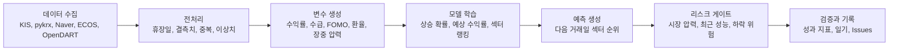

# 국내 주식 섹터 상승 예측 프로젝트

뉴스, 수급, 환율, FOMO 관심도, 장중 흐름을 수집해 다음 거래일에 상대적으로 강할 가능성이 높은 국내 주식 섹터를 예측하는 데이터 분석 프로젝트입니다.

이 프로젝트는 자동매매 시스템이 아니라, 데이터 수집부터 전처리, 변수 생성, 모델 학습, 예측, 검증, 문제 해결 기록까지 직접 설계한 포트폴리오형 머신러닝 프로젝트입니다.

## 30초 요약

| 면접관이 확인할 질문 | 답변 |
| --- | --- |
| 어떤 문제를 풀었나 | 다음 거래일에 어느 국내 주식 섹터가 상대적으로 강할지 예측하는 문제를 정의했습니다. |
| 왜 섹터 예측부터 했나 | 개별 종목은 노이즈가 크기 때문에, 먼저 시장의 자금 이동을 섹터 단위로 파악하는 1차 모델을 만들었습니다. |
| 본인이 한 역할은 무엇인가 | 데이터 수집, 전처리, 변수 설계, 모델 학습, 검증, 자동화, GitHub 문서화를 직접 설계하고 운영했습니다. |
| 어떤 판단 근거가 있나 | KIS, pykrx, Naver, ECOS, OpenDART 데이터를 결합하고 예측 결과를 매일 실제 결과와 비교했습니다. |
| 결과를 어떻게 검증했나 | 방향 적중률, Top3 겹침률, RankIC, NDCG@3, 예상 수익률 구간 커버율로 검증했습니다. |
| 문제 해결 과정은 어디에 있나 | 오류와 개선 과정은 [GitHub Issues](https://github.com/HCG0313/part-prediction/issues)에 기간별로 기록했습니다. |

## 내 역할

| 역할 | 수행 내용 |
| --- | --- |
| 문제 정의 | 개별 종목 추천이 아니라 섹터 상승 가능성과 예상 수익률을 먼저 예측하는 구조로 설계 |
| 데이터 엔지니어링 | KIS, pykrx, Naver, ECOS, OpenDART 수집 파이프라인 구성 및 fallback 설계 |
| 피처 엔지니어링 | 수익률, 수급, 뉴스 관심도, FOMO, 환율, 장중 시장 압력, 시장 국면 변수 생성 |
| 모델링 | 상승 확률, 예상 수익률, 섹터 랭킹, FOMO overlay, 리스크 게이트, 섀도 모델 구성 |
| 검증 | 예측 결과와 실제 시장 결과를 매일 비교하고, 성능 저하 원인을 기록 |
| 포트폴리오 관리 | README는 프로젝트 요약, Issues는 문제 해결 기록, 일기는 예측 비교 기록으로 분리 |

## 현재 상태

| 항목 | 내용 |
| --- | --- |
| 최신 정리 기준 | 2026-07-09 장마감 데이터 |
| 예측 대상 | 2026-07-10 다음 거래일 섹터 흐름 |
| 최신 수집 상태 | KIS OpenAPI 기준 240개 종목 성공, pykrx/Naver/ECOS 2026-07-09까지 갱신 |
| 현재 라이브 모델 | `tomorrow_total_score + FOMO overlay` 기반 섹터 예측 |
| 최신 FOMO 반영 비중 | 0.2200 |
| 장중 시장 압력 | 0.246, 시장 압력 낮음 |
| 현재 운영 판단 | 라이브 모델 유지, 서브 모델은 섀도 방식으로 성능 추적 |
| 최신 예측 상위권 | 반도체/전자, 조선/방산, 2차전지, 통신, 유통/소비 |
| 실행 판단 | 반도체/전자는 방어 관찰, 조선/방산과 2차전지는 관망, 통신/금융은 행동층 관찰 후보 |

## 핵심 성과 지표

| 지표 | 현재 값 | 해석 |
| --- | ---: | --- |
| 평가 예측 수 | 420건 | 2026-05-12부터 2026-07-09까지 누적 평가 |
| 방향 예측률 | 44.5% | 단순 상승/하락 방향은 아직 개선 필요 |
| Top3 겹침률 | 31.4% | 예측 상위 3개와 실제 상위권 겹침 정도 |
| RankIC 평균 | 0.031 | 섹터 순위 예측의 상관성은 낮은 양수 |
| NDCG@3 | 0.586 | 상위권 정렬 품질을 보는 보조 지표 |
| 수익률 구간 커버율 | 82.3% | 예상 수익률 구간 안에 실제 결과가 들어온 비율 |

현재 모델은 완성형이라기보다, 매일 검증하면서 개선하는 실험형 예측 시스템입니다. 성능이 불안정할 때 바로 매수 신호를 내지 않고 리스크 게이트로 행동을 낮추는 구조를 함께 설계했습니다.

## 왜 이 방식인가

| 의사결정 | 이유 |
| --- | --- |
| 개별 종목보다 섹터 예측 우선 | 개별 종목은 이벤트 노이즈가 크므로, 먼저 산업군 단위 흐름을 안정적으로 학습하기 위해 |
| FOMO 변수를 별도 overlay로 분리 | 뉴스와 관심도 급증은 항상 가격 상승으로 이어지지 않기 때문에, 기본 모델에 바로 섞지 않고 보정층으로 관리 |
| 메인 모델과 섀도 모델 분리 | 새 모델이 하루 잘 맞았다고 바로 교체하지 않고, 일정 기간 성과를 누적 비교하기 위해 |
| 리스크 게이트 추가 | 예측 상위 섹터가 있어도 시장 전체 압력이 강하면 최종 행동을 회피로 낮추기 위해 |
| Issues 중심 문제 해결 기록 | 면접관이 문제, 원인, 해결, 검증 과정을 날짜별로 추적할 수 있게 하기 위해 |

## 시스템 흐름



## 데이터 구성

| 데이터 | 역할 |
| --- | --- |
| KIS OpenAPI | 장중 가격, 현재가, 섹터별 실시간 흐름 확인 |
| Naver Finance fallback | KIS 연결이 불안정할 때 대체 실시간 가격 수집 |
| KRX/pykrx | 일봉 가격, 거래대금, 종목 기본 데이터 |
| Naver 뉴스/검색 | 뉴스 강도와 관심도 기반 FOMO 변수 생성 |
| ECOS/환율 | 원달러 환율과 거시 스트레스 변수 |
| OpenDART | 공시 이벤트 변수 |
| 글로벌 시장 보조 데이터 | 해외 시장 흐름과 리스크 보조 변수 |

## 모델 구조

| 층 | 역할 |
| --- | --- |
| 상승 확률 모델 | 다음 거래일 섹터가 상승할 가능성을 예측 |
| 예상 수익률 모델 | 상승 여부뿐 아니라 예상 수익률 중심값과 구간을 추정 |
| 섹터 랭킹 모델 V3~V5 | 섹터 간 상대 순위를 예측 |
| FOMO overlay | 뉴스와 관심도 급증이 가격 반응으로 이어질 가능성을 보정 |
| 장중 시장 압력 | 지수와 다수 섹터가 동시에 밀릴 때 시장 약세 강도를 반영 |
| 시장 국면 라우터 | 상승장, 하락장, 급락 후 반등장에 따라 가중치를 다르게 적용 |
| 리스크 게이트 | 최근 성능이 불안정하거나 시장 압력이 강할 때 최종 행동을 낮춤 |
| 섀도 모델 | 메인 모델을 바로 교체하지 않고 후보 모델 성과를 따로 누적 비교 |

## 최신 예측 요약

2026-07-09 장마감 후 2026-07-10을 대상으로 한 예측입니다.

| 순위 | 섹터 | 점수 | 예상 중심 수익률 | 행동 | 해석 |
| ---: | --- | ---: | ---: | --- | --- |
| 1 | 반도체/전자 | 0.775 | +0.69% | 방어 관찰 | FOMO와 글로벌 반도체 프록시는 강하지만 확률 신뢰도는 낮아 추격보다 확인 중심 |
| 2 | 조선/방산 | 0.645 | +0.77% | 관망 | 예상 중심 수익률은 가장 높지만 전일 약세와 변동성이 있어 관망 |
| 3 | 2차전지 | 0.632 | +0.45% | 관망 | 전일 강세가 이어질 가능성은 있으나 예상 구간 폭이 넓어 확인 필요 |
| 4 | 통신 | 0.438 | +0.19% | 방어형 관찰 후보 | V5 점수와 방어 성격은 좋지만 최종 점수는 중위권 |
| 5 | 유통/소비 | 0.379 | +0.25% | 회피 유지 | 점수와 신뢰도가 낮아 방어 후보로만 참고 |

메인 모델은 아직 교체하지 않습니다. 최신 베타 비교에서 현재 성능 리더는 기존 `baseline_main_total`이고, 성장 후보는 `beta_router_shadow`입니다. 딥러닝 MLP 베타는 표본 부족과 낮은 Top3 겹침률 때문에 shadow 관찰만 유지합니다.

## 포트폴리오 증거

| 증거 | 링크 | 면접에서 보여주는 내용 |
| --- | --- | --- |
| 문제 해결 기록 | [GitHub Issues](https://github.com/HCG0313/part-prediction/issues) | 문제 정의, 원인 분석, 해결 방법, 검증 결과 |
| 2026-07-09 해결 사례 | [Issues #23](https://github.com/HCG0313/part-prediction/issues/23) | 후보 신뢰도 피드백, 베타 라우터/딥러닝 shadow 비교, 메인 교체 보류 판단 |
| 2026-07-08 해결 사례 | [Issues #22](https://github.com/HCG0313/part-prediction/issues/22) | Python 실행 환경 오류와 KIS/pykrx 검증 |
| 일일 예측 일기 | [docs/daily-prediction-diary.md](docs/daily-prediction-diary.md) | 예측과 실제 결과 비교 |
| 모델 개발 로그 | [docs/model-development-log-beta.md](docs/model-development-log-beta.md) | 모델 구조 변경과 개선 과정 |
| 성능 검증 | [docs/results.md](docs/results.md) | 최신 성능 지표와 한계 |
| 전체 실행 노트북 | [notebooks/part_prediction_portfolio_pipeline.ipynb](notebooks/part_prediction_portfolio_pipeline.ipynb) | 수집부터 예측까지의 전체 흐름 |

## 주요 산출물

| 파일 | 설명 |
| --- | --- |
| [reports/tomorrow_sector_prediction.csv](reports/tomorrow_sector_prediction.csv) | 최신 다음 거래일 섹터 예측표 |
| [reports/tomorrow_sector_prediction_compact.csv](reports/tomorrow_sector_prediction_compact.csv) | 짧은 변수명 기반 예측표 |
| [reports/tomorrow_sector_variable_dictionary.md](reports/tomorrow_sector_variable_dictionary.md) | 짧은 변수명과 원본 변수 설명 |
| [reports/model_weight_status.json](reports/model_weight_status.json) | 메인/서브 모델 가중치 상태 |
| [reports/model_weight_shadow_prediction.csv](reports/model_weight_shadow_prediction.csv) | 섀도 블렌드 기준 예측표 |
| [reports/intraday_collection_summary.json](reports/intraday_collection_summary.json) | 장중 수집 상태 |
| [reports/prediction_accuracy_summary.json](reports/prediction_accuracy_summary.json) | 예측 성과 요약 |

## 실행 방법

```powershell
cd "C:\Users\mobu3\OneDrive\바탕 화면\금융파일\fx_fomo_stock_model"
powershell -ExecutionPolicy Bypass -File .\scripts\run_daily_collection.ps1
```

모델 가중치 상태만 갱신하려면 다음을 실행합니다.

```powershell
python .\scripts\update_model_weight_status.py
```

API 키와 토큰은 코드에 직접 저장하지 않고 환경 변수 또는 로컬 설정으로 분리합니다.

## 현재 한계와 다음 개선

| 한계 | 개선 방향 |
| --- | --- |
| 방향 예측률이 아직 낮음 | 메인 모델 교체보다 섀도 모델 성과를 누적 비교 |
| Top3 안정성이 부족함 | 순위 모델과 예상 수익률 모델의 조합 검증 강화 |
| 시장 급락일에 신호 해석이 어려움 | 장중 시장 압력과 리스크 게이트를 더 세분화 |
| KIS 연결 변동성 | KIS와 Naver fallback 파일을 분리하고 active source 기록 유지 |
| 개별 종목 확장 전 단계 | 섹터 예측 안정화 후 섹터 내부 종목 후보 모델로 확장 |

## 면접에서 설명할 핵심 문장

이 프로젝트는 단순히 주가를 맞히는 모델이 아니라, 데이터 수집부터 검증까지 재현 가능한 예측 시스템을 만들고 매일 실패 원인을 기록하며 개선하는 프로젝트입니다. 특히 새 모델을 바로 교체하지 않고 섀도 모델로 추적한 뒤, 검증 지표가 충분할 때만 반영하는 방식으로 모델 운영 안정성을 고려했습니다.

## 주의

이 프로젝트의 예측 결과는 투자 추천이 아닙니다. 목표는 데이터를 기반으로 시장 흐름을 분석하고, 예측 모델의 개선 과정을 검증 가능한 형태로 기록하는 것입니다.
