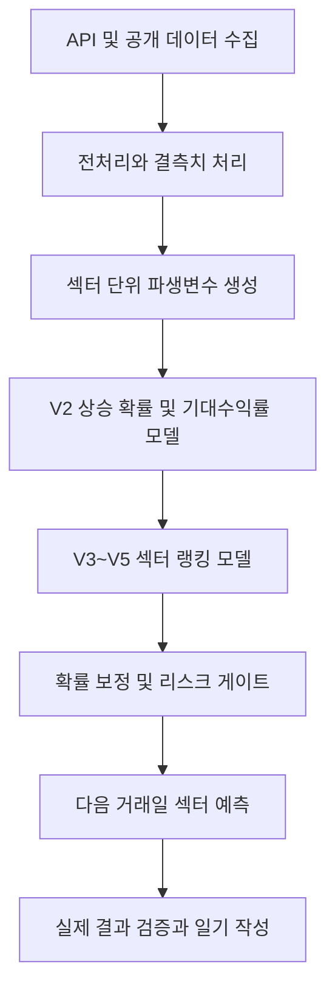

# 파트 예측

> 뉴스, 검색 관심도, FOMO 기대효과, 환율, 수급, 거래대금, 장중 차트 데이터를 통합해 다음 거래일 국내 주식 섹터의 상승 가능성과 상대 강도를 예측하는 머신러닝 프로젝트입니다.

이 저장소는 투자 추천이나 자동매매 지침이 아니라, 데이터 수집부터 전처리, 변수 생성, 모델 학습, 확률 보정, 예측 검증까지 이어지는 개인 프로젝트 기록입니다.

## 프로젝트 개요

`파트 예측`은 개별 종목을 바로 예측하기 전에 먼저 섹터 단위로 시장을 해석합니다.

- 예측 단위: 반도체/전자, 금융, 2차전지, 조선/방산, 자동차, 바이오 등 국내 주식 섹터
- 예측 목표: 다음 거래일에 상대적으로 강할 가능성이 높은 섹터 탐색
- 사용 데이터: KRX, pykrx, KIS, NAVER 뉴스, NAVER 수급, ECOS 환율, OpenDART, 글로벌 시장 데이터
- 모델 방식: 머신러닝 앙상블, 섹터 랭킹 모델, 확률 보정, 리스크 게이트
- 운영 방식: 장마감 후 수집, 학습, 예측, 다음 날 검증, 일기 기록

## 모델 흐름

## 주요 산출물

| 파일 | 내용 |
| --- | --- |
| `docs/daily-prediction-diary.md` | 날짜별 일기 전체 인덱스 |
| `docs/diary/YYYY-MM-DD.md` | 날짜별 상세 일기 |
| `notebooks/part_prediction_portfolio_pipeline.ipynb` | 포트폴리오 발표용 전체 파이프라인 노트북 |
| `reports/tomorrow_sector_prediction.csv` | 다음 거래일 섹터 예측 결과 |
| `reports/probability_calibration_report.md` | 확률 보정 결과 리포트 |

## 일일 예측 일기

매일 장마감 후 그날의 시장 결과, 전일 예측과 실제 결과의 차이, 모델이 새로 학습한 점, 다음 거래일 판단을 기록합니다.

| 날짜 | 상세 기록 | 핵심 내용 |
| --- | --- | --- |
| 2026-06-12 | [2026-06-12 일기](docs/diary/2026-06-12.md) | GitHub 포트폴리오 구조 정리, 확률 보정 기반 의사결정 레이어 반영 |
| 2026-06-11 | [2026-06-11 일기](docs/diary/2026-06-11.md) | 반도체/전자 핵심 관찰 신호, 6월 12일 강한 상승장 검증 |
| 2026-06-10 | [2026-06-10 일기](docs/diary/2026-06-10.md) | 조선/방산 중심 예측과 6월 11일 반등장 오차 점검 |
| 2026-06-09 | [2026-06-09 일기](docs/diary/2026-06-09.md) | 금융, 조선/방산, 유통/소비 보조 관찰과 약세장 대응 |
| 2026-06-08 | [2026-06-08 일기](docs/diary/2026-06-08.md) | 주말 이후 회피 게이트와 실제 급반등 괴리 확인 |
| 2026-06-05 | [2026-06-05 일기](docs/diary/2026-06-05.md) | 전 섹터 하락장, capitulation 국면, 회피 게이트 강화 |
| 2026-06-04 | [2026-06-04 일기](docs/diary/2026-06-04.md) | 휴장일, 중복 학습, 환율 수집, 결측치 전처리 문제 정리 |
| 2026-06-03 | [2026-06-03 일기](docs/diary/2026-06-03.md) | 휴장일 뉴스, 검색량, FOMO 기대효과 중심 예측 |
| 2026-06-02 | [2026-06-02 일기](docs/diary/2026-06-02.md) | 뉴스 관심도와 실제 수익률 괴리 확인 |
| 2026-06-01 | [2026-06-01 일기](docs/diary/2026-06-01.md) | GitHub 기록 시작, 인터넷/플랫폼 핵심 신호 검증 |

## 현재 모델 해석

현재 모델은 딥러닝이 아니라 머신러닝 기반입니다. V2 모델은 다음 거래일 섹터 수익률과 상승 확률을 예측하고, V3~V5 모델은 섹터 간 상대 순위를 계산합니다. 최근에는 모델이 확률을 과하게 자신 있게 내는 문제를 줄이기 위해 백테스트 기반 확률 보정을 추가했습니다.

따라서 최종 결과는 단순히 `오를 섹터`를 찍는 것이 아니라 다음을 함께 보여줍니다.

- 상승 가능성
- 시장 대비 초과 상승 가능성
- 거래 가능한 상승 가능성
- 보정된 확률
- 관망, 보조 관찰, 핵심 관찰, 회피 우선 같은 행동 라벨
- 모델이 과신하고 있는지에 대한 경고

## 포트폴리오 설명 문장

> 이 프로젝트는 국내 주식시장의 뉴스, 수급, 환율, 거래대금, 장중 차트 데이터를 통합해 다음 거래일 섹터별 상승 가능성과 상대 강도를 예측하고, 확률 보정을 통해 실전 판단에 사용할 수 있는 섹터 후보를 생성하는 머신러닝 기반 개인 프로젝트입니다.
