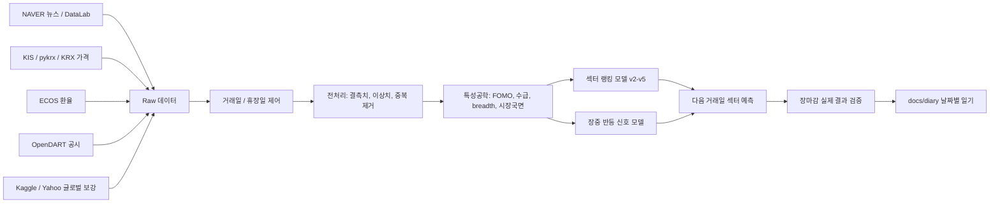

# 파트 예측

> 뉴스, 검색 관심도, FOMO 기대효과, 환율, 수급, 공시, 장중 차트 데이터를 결합해 국내 주식 섹터의 다음 거래일 반응을 예측하고 검증하는 데이터/AI 연구형 포트폴리오입니다.

이 저장소는 투자 추천이나 자동매매 지침이 아니라, 모델 개발 과정과 예측 검증을 누적하는 프로젝트 기록입니다. 핵심 목표는 "뉴스와 FOMO 기대효과가 실제 다음 거래일 섹터 강세로 이어지는가"를 데이터로 확인하는 것입니다.

## 5초 요약

| 항목 | 내용 |
| --- | --- |
| 프로젝트 주제 | 국내 주식 섹터별 다음 거래일 반응 예측 |
| 핵심 질문 | 뉴스/FOMO 기대효과가 실제 가격 반응으로 연결되는가 |
| 내 역할 | 데이터 수집, 전처리, 특성공학, 모델 학습, 예측 검증, 자동화, GitHub 기록 |
| 주요 데이터 | KIS, pykrx/KRX, NAVER 뉴스, NAVER DataLab, ECOS 환율, OpenDART, 글로벌 보강 데이터 |
| 현재 모델 | 머신러닝 기반 섹터 랭킹 모델 + 장중 반등 신호 모델 + 시장 국면 게이트 |
| 최신 상태 | 2026-06-12 장마감 기준 누적 방향 정확도 46.2%, 반도체/전자 핵심 관찰 적중과 방향 예측 실패를 분리 분석 |
| 주의 사항 | 실전 투자 판단용이 아니라 데이터/모델 검증용 연구 기록 |

## 포트폴리오 관점

이 프로젝트는 단순히 "주가를 맞히는 모델"을 만드는 것이 아니라, 다음 흐름을 검증하는 데 초점을 둡니다.

1. 뉴스와 검색 관심도가 강한 섹터를 수집한다.
2. FOMO 기대효과, 가격 흐름, 수급, 환율, 공시, 시장 국면을 함께 계산한다.
3. 다음 거래일 섹터 강세 후보를 예측한다.
4. 장마감 후 실제 결과와 전일 예측을 비교한다.
5. 맞은 이유보다 틀린 이유를 더 자세히 기록하고 모델을 수정한다.

## 데이터 파이프라인

## 핵심 문서

| 문서 | 설명 |
| --- | --- |
| [데이터 파이프라인](docs/data-pipeline.md) | 수집원, 자동화 흐름, 거래일 제어 구조 |
| [모델 구조](docs/model-structure.md) | 현재 모델이 학습하고 예측을 출력하는 방식 |
| [특성공학과 전처리](docs/feature-engineering.md) | FOMO 점수, 시장 국면, 결측치/이상치 처리 |
| [문제 해결 기록](docs/troubleshooting.md) | 수집 오류, 휴장일 중복 학습, 환율/차트 문제 해결 |
| [검증 결과](docs/results.md) | 일별 예측 결과와 모델이 학습한 점 |
| [일기 운영 가이드](docs/daily-prediction-diary.md) | 매일 장마감 후 어떤 형식으로 기록할지 정리 |
| [일별 기록](docs/diary/README.md) | 날짜별 장마감 예측 일기 인덱스 |
| [포트폴리오 점검표](docs/portfolio-checklist.md) | GitHub 포트폴리오 관점의 자체 점검표 |

## 모델이 보는 주요 신호

| 신호 그룹 | 예시 | 해석 |
| --- | --- | --- |
| 뉴스/FOMO | 뉴스 빈도, 검색 관심도, 키워드 강도 | 시장 관심이 특정 섹터에 몰리는지 확인 |
| 가격 흐름 | 섹터 수익률, 전일 대비 변화, 장중 회복률 | 관심이 실제 가격 반응으로 이어졌는지 확인 |
| 시장 폭 | 상승 종목 비율, breadth 변화 | 일부 종목만 오른 것인지 섹터 전체가 움직인 것인지 확인 |
| 수급 | 투자자 수급, 거래대금 순위 | 관심이 실제 자금 유입으로 연결되는지 확인 |
| 거시/환율 | ECOS 환율, 글로벌 보강 데이터 | 외부 리스크가 섹터 반응을 누르는지 확인 |
| 캘린더 | 주말, 공휴일, 다음 거래일 상태 | 휴장일 중복 수집과 중복 학습 방지 |

## 최근 일기

### 2026-06-12 금요일

- 실제 Top 5는 `반도체/전자`, `자동차`, `2차전지`, `철강/소재`, `통신`이었다.
- 전일 예측 Top 5와 실제 Top 5 겹침은 3개였고, Top 3 겹침은 1개였다.
- 전일 핵심 관찰 후보였던 `반도체/전자`가 실제 +11.27%로 1위를 기록했다.
- `통신`도 보조 관찰 후보로 실제 Top 5 안에 들어갔다.
- 다만 원시 방향 예측은 전 섹터 상승장을 잡지 못해 오늘 방향 적중은 0/12였다.
- 누적 방향 정확도는 264개 평가 기준 `46.2%`로 낮아졌다.
- 모델은 후보 선정 성공과 방향 예측 실패를 분리해서 봐야 한다는 점을 학습했다.
- 다음 거래일인 2026-06-15 예측은 `반도체/전자`, `금융`, `조선/방산`, `자동차`, `통신`을 보조 관찰 중심으로 정리했다.

상세 기록: [2026-06-12 일기](docs/diary/2026-06-12.md)

### 2026-06-11 목요일

- 실제 Top 5는 `반도체/전자`, `게임/엔터`, `2차전지`, `화학/정유`, `통신`이었다.
- 전일 예측 Top 5와 실제 Top 5 겹침은 `2차전지` 1개뿐이었다.
- 방향 정확도는 9/12였지만, 실제 후보 선정 관점에서는 `조선/방산`을 보조 관찰로 둔 판단이 실패했다.
- 누적 방향 정확도는 252개 평가 기준 `48.4%`로 갱신됐다.
- 모델은 전일 약세와 확산 부족 페널티가 너무 강하면 다음 날 대형 반도체 중심 급반등을 놓칠 수 있다는 점을 학습했다.

상세 기록: [2026-06-11 일기](docs/diary/2026-06-11.md)

### 2026-06-10 수요일

- 실제 Top 5는 `조선/방산`, `유통/소비`, `철강/소재`, `화학/정유`, `바이오`였다.
- 전일 예측 Top 5와 실제 Top 5 겹침은 2개였다.
- 장중 학습 과정에서 일부 `inf` 값이 모델 입력으로 들어가는 문제를 확인하고 방어 처리했다.
- 누적 방향 정확도는 240개 평가 기준 `47.1%`로 갱신됐다.

상세 기록: [2026-06-10 일기](docs/diary/2026-06-10.md)

### 2026-06-09 화요일

- 실제 장세는 전 섹터 상승의 `risk_on` 반등장이었다.
- 모델은 전일 급락의 방어 판단을 유지해 큰 반등 폭과 주도 섹터 포착은 부족했다.
- 장 시작 전 KIS 스냅샷에서 0%와 `inf` 값이 생긴 문제를 확인하고 유효 스냅샷으로 되돌렸다.
- 누적 방향 정확도는 228개 평가 기준 `46.1%`로 갱신됐다.

상세 기록: [2026-06-09 일기](docs/diary/2026-06-09.md)

### 2026-06-08 월요일

- 시장 국면은 `capitulation`으로 분류됐고 12개 섹터가 모두 하락했다.
- 전일 예측 Top 3와 실제 Top 3 겹침은 없었지만, 전 섹터 `회피 우선` 게이트는 유효했다.
- 모델은 과매도 관찰 신호가 곧 반등 신호가 아니며, 급락장에서는 시장 폭과 거래대금 가중 하락을 더 강하게 봐야 한다는 점을 학습했다.

상세 기록: [2026-06-08 일기](docs/diary/2026-06-08.md)

## 프로젝트의 현재 한계

- 누적 방향 정확도는 아직 50% 전후라 실전 투자 판단에는 부족합니다.
- 뉴스와 검색 관심도는 반응 가능성을 보여주지만, 가격과 수급 확인 없이 바로 수익률로 이어지지는 않습니다.
- 급락장과 급반등장에서는 모델이 과거 하루의 페널티를 과하게 끌고 가는 문제가 있습니다.
- 정확도보다 중요한 다음 목표는 "상승 후보를 너무 늦게 잡는 문제"와 "회피해야 할 섹터를 빨리 걸러내는 문제"를 분리해서 개선하는 것입니다.

## 다음 개선 방향

1. 뉴스/FOMO 점수와 실제 가격 반응 사이의 시차를 분리한다.
2. `risk_on`, `risk_off`, `capitulation`, `mixed_rotation` 국면별 모델 가중치를 다르게 둔다.
3. 장중 반등 신호 모델의 precision/recall을 정확도보다 우선해서 개선한다.
4. KRX 공식 데이터 지연과 KIS 실시간 데이터의 역할을 명확히 분리한다.
5. GitHub 일기는 매일 "예측, 실제 결과, 오차 원인, 모델이 배운 점" 형식으로 유지한다.

## 문서 운영 규칙

- README는 포트폴리오 첫 화면이므로 프로젝트 요약, 핵심 구조, 최근 결과만 유지합니다.
- 상세 일기는 [docs/diary/](docs/diary/) 폴더의 날짜별 파일로 관리합니다.
- 새 일기는 [일기 템플릿](docs/diary/TEMPLATE.md)을 기준으로 작성합니다.
- 중복 기록을 줄이기 위해 `docs/daily-prediction-diary.md`는 상세 일기 본문이 아니라 운영 가이드로 사용합니다.
