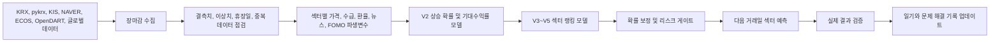

# 파트 예측: 국내 주식 섹터 상승 예측 프로젝트

최근 업데이트: 2026-06-21 예상 수익률 구간 보정 기준

> 뉴스, 수급, 환율, FOMO 관심도, 글로벌 시장 변수, 장중 흐름을 수집해 다음 거래일에 상대적으로 강할 가능성이 높은 국내 주식 섹터를 예측하는 머신러닝 프로젝트입니다.

이 저장소는 투자 추천이나 자동매매 시스템이 아니라, 데이터 수집부터 전처리, 변수 생성, 모델 학습, 확률 보정, 예측 검증, 문제 해결 기록까지 이어지는 개인 데이터 프로젝트 포트폴리오입니다.

## 5초 요약

| 항목 | 내용 |
| --- | --- |
| 해결하려는 문제 | 장마감 이후 흩어진 뉴스, 수급, 환율, 차트 정보를 통합해 다음 거래일에 강할 섹터를 빠르게 점검한다. |
| 내 역할 | API 수집 파이프라인, 전처리, 파생변수, 머신러닝 모델, 예측 검증, GitHub 기록 구조를 직접 설계했다. |
| 현재 결과 | 최신 실전 방향 정확도는 약 46.6%, Top3 실제 Top3 겹침률은 약 29.6%이다. |
| 핵심 증거 | [일일 예측 일기](docs/daily-prediction-diary.md), [문제 해결 기록](docs/problem-solving-log.md), [포트폴리오 노트북](notebooks/part_prediction_portfolio_pipeline.ipynb) |
| 주의 사항 | 실전 매수 신호가 아니라 모델 개발과 검증 기록이며, 모든 예측은 다음 날 실제 결과로 다시 검증한다. |

## 2026-06-21 업그레이드 요약

오늘은 모델을 새로 갈아엎지 않고, 최근 실제 예측 구간이 하방 위험을 충분히 반영하지 못하는 문제를 보정했다.  
핵심 결론은 `예상 수익률 중심값보다 하단 구간과 구간 폭을 함께 보고, 최종 행동은 보수적으로 유지`이다.

| 개선 항목 | 결과 | 증거 |
| --- | --- | --- |
| 예상 수익률 구간 보정 | 최근 5개 평가일 기준 구간 적중률 63.3%, 하단 이탈률 31.7%를 반영해 하단 구간을 평균 1.814%p 보수화 | [구간 보정 요약](reports/return_interval_calibration_summary.json) |
| 원본/보정값 동시 기록 | `expected_return_low_pct_raw`와 보정 후 `expected_return_low_pct`를 함께 남겨 사후 검증 가능 | [내일 예측 CSV](reports/tomorrow_sector_prediction.csv) |
| 예측 후보와 최종 행동 분리 유지 | 2026-06-22 예측 후보는 조선/방산·자동차·금융·2차전지지만, 최종 행동은 전 섹터 회피 우선 | [예상 수익률 구간 리포트](reports/expected_return_interval_report.md) |
| 포트폴리오 문제 해결 기록 추가 | 문제-원인-점검-해결-검증 흐름으로 36번 문제 기록 | [문제 해결 기록](docs/problem-solving-log.md) |

## 최신 운영 기록

| 기준일 | 시장 요약 | 검증 결과 | 다음 거래일 예측 |
| --- | --- | --- | --- |
| 2026-06-21 | 주말 모델 점검일. 신규 장마감 데이터는 없고, 2026-06-19까지의 실제 예측 구간 이탈률을 재검토 | 최근 60개 평가 행 기준 구간 적중률 63.3%, 하단 이탈률 31.7%로 하방 위험 과소평가 확인. 하단 보정 레이어를 예측 흐름에 연결 | 2026-06-22 기준 예측 레이어 상위는 조선/방산·자동차·금융·2차전지·게임/엔터. 다만 V5 no-trade와 랭킹 품질 경고로 최종 행동은 전 섹터 회피 우선 |
| 2026-06-19 | 평균 섹터 수익률 -2.38%, 12개 섹터 모두 하락. 금융·2차전지·유통/소비·자동차가 상대 방어 | 6월 18일 예측은 전 섹터 회피 우선이었고 실제로 전 섹터가 하락해 큰 방향은 맞았다. 방어 추적 후보 중 금융·유통/소비는 상대 방어에 성공했지만 반도체/전자·바이오는 실패했다. | 2026-06-22 기준 12개 섹터 모두 회피 우선. 조선/방산·자동차·금융·2차전지는 장초반 회복 확인용 방어 추적 후보 |
| 2026-06-18 | 평균 섹터 수익률 -3.15%, 12개 섹터 모두 하락한 capitulation 장세, 반도체/전자·금융·유통/소비가 상대 방어 | 6월 17일 점수 1위 조선/방산은 -5.38%로 실패했다. 다만 최종 의사결정이 방어 관찰로 낮춘 반도체/전자는 실제 상대 1위가 됐다. | 2026-06-19 기준 12개 섹터 모두 회피 우선. 반도체/전자·금융·유통/소비는 장초반 회복 확인용 상대 방어 후보 |
| 2026-06-17 | 평균 섹터 수익률 -0.39%, 바이오·게임/엔터·반도체/전자 강세, 자동차·통신·금융 약세 | 6월 16일 핵심 관찰 조선/방산은 +0.05%로 방향만 맞았고, 자동차·금융 보조 관찰은 실패했다. 실제 주도는 회피 우선이었던 바이오·게임/엔터·반도체였다. | 2026-06-18 기준 반도체/전자 방어 관찰, 조선/방산·게임/엔터 관망, 바이오 추격 주의 |
| 2026-06-16 | 평균 섹터 수익률 +0.22%, 조선/방산·자동차·금융 강세, 반도체/전자·2차전지 약세 | 6월 15일 보조 관찰 5개 중 조선/방산·자동차·금융은 성공했고, 2차전지·반도체/전자는 실패했다. | 2026-06-17 기준 핵심 관찰: 조선/방산, 보조 관찰: 자동차·금융 |

상세 내용은 [2026-06-21 일기](docs/diary/2026-06-21.md)에 정리했습니다.

## 프로젝트 의미

개별 종목을 바로 예측하면 노이즈가 크고, 이벤트성 급등락에 모델이 쉽게 흔들립니다. 그래서 이 프로젝트는 먼저 섹터 단위로 시장을 해석합니다. 섹터 예측은 이후 개별 종목 예측 모델로 확장하기 위한 1차 구조입니다.

핵심 질문은 세 가지입니다.

1. 오늘 어떤 섹터에 뉴스와 관심이 몰렸는가?
2. 그 관심이 다음 거래일 가격 상승으로 이어질 가능성이 있는가?
3. 모델이 과신하고 있다면 관망 또는 회피로 낮춰야 하는가?

## 전체 파이프라인



## 데이터 수집 구조

| 데이터 | 수집 목적 | 현재 상태 |
| --- | --- | --- |
| KRX, pykrx | 종목 가격, 섹터 수익률, 거래대금 | 정상 수집 |
| KIS | 장중 스냅샷과 실시간 흐름 | 타임아웃 시 Naver realtime fallback 사용 |
| NAVER 뉴스 | 섹터별 뉴스 관심도와 FOMO proxy | 정상 수집 |
| NAVER DataLab | 검색 트렌드 | 인증 이슈로 뉴스 proxy를 우선 사용 |
| ECOS | 원/달러 환율과 거시 변수 | 수집 상태값을 함께 기록 |
| OpenDART | 공시 이벤트 | 정상 수집 |
| Kaggle/Yahoo 기반 글로벌 데이터 | 글로벌 위험 선호도, 원자재, 해외 지수 | 보조 변수로 사용 |

## 모델 구조

| 모델 | 역할 | 해석 |
| --- | --- | --- |
| V2 | 다음 거래일 수익률, 상승 확률, 의미 있는 상승, 초과 상승, 거래 가능 상승을 예측 | 방향성 판단의 기본 레이어 |
| V3 | 다음 거래일 시장 대비 강한 섹터를 랭킹으로 예측 | Top-K 후보 선별 |
| V4 | 시장 국면, 약한 시장 폭, capitulation 위험을 반영 | 약세장 회피 게이트 |
| V5 | Qlib-lite 팩터, 글로벌 변수, FOMO 논문 아이디어, 섹터 관계 그래프를 반영 | 현재 메인 랭킹 모델 |
| Decision layer | 보정 확률, 기대수익률, 리스크, 랭킹 점수를 결합 | 핵심 관찰, 보조 관찰, 관망, 회피 우선 라벨 출력 |

현재 모델은 딥러닝이 아니라 머신러닝 앙상블과 랭킹 모델 중심입니다. 출력도 단순히 "오른다/내린다"가 아니라 상승 가능성, 기대수익률 범위, 시장 대비 초과 가능성, 보정 확률, 행동 라벨을 함께 제공합니다.

## 최신 모델 성능

| 지표 | 값 |
| --- | --- |
| 모델 | sector_rank_model_v5 |
| 학습 기준 | 2026-06-19 장마감 후 |
| 학습 행 수 | 9,132 |
| 사용 특성 수 | 301 |
| Walk-forward Top1 평균 수익률 | 약 0.45% |
| Walk-forward Top1 초과수익률 | 약 0.21% |
| Walk-forward Top3 평균 수익률 | 약 0.37% |
| Walk-forward Top3 양수 비율 | 약 54.4% |
| 최근 실전 방향 정확도 | 약 46.6% |

성능은 아직 안정적인 투자 자동화 수준이 아닙니다. 그래서 이 프로젝트는 높은 정확도를 주장하기보다, 매일 실패 원인을 기록하고 모델을 개선하는 과정을 포트폴리오의 핵심 증거로 삼습니다.

## 일일 예측 일기

| 날짜 | 상세 기록 | 핵심 내용 |
| --- | --- | --- |
| 2026-06-21 | [2026-06-21 일기](docs/diary/2026-06-21.md) | 예상 수익률 구간 보정, 하방 위험 과소평가 개선, 6월 22일 전 섹터 회피 우선 예측 |
| 2026-06-19 | [2026-06-19 일기](docs/diary/2026-06-19.md) | 전 섹터 하락 약세장 지속, 전일 회피 우선 판단 유효, 6월 22일 조선/방산·자동차·금융·2차전지 방어 추적 |
| 2026-06-18 | [2026-06-18 일기](docs/diary/2026-06-18.md) | 전 섹터 하락 capitulation 장세, 반도체/전자 상대 방어, 6월 19일 전 섹터 회피 우선 예측 |
| 2026-06-17 | [2026-06-17 일기](docs/diary/2026-06-17.md) | 바이오·게임/엔터 실제 강세, 조선/방산 핵심 관찰은 방향만 적중, 6월 18일 반도체/전자 방어 관찰 |
| 2026-06-16 | [2026-06-16 일기](docs/diary/2026-06-16.md) | 조선/방산·자동차·금융 보조 관찰 성공, 반도체/전자·2차전지 추격 위험 확인, GitHub 기록 누락 복구 |
| 2026-06-15 | [2026-06-15 일기](docs/diary/2026-06-15.md) | 장마감 수집·학습 완료, 6월 12일 예측 검증, 포트폴리오 README와 문제 해결 기록 개편 |
| 2026-06-12 | [2026-06-12 일기](docs/diary/2026-06-12.md) | GitHub 포트폴리오 구조 정리, 확률 보정 기반 의사결정 레이어 반영 |
| 2026-06-11 | [2026-06-11 일기](docs/diary/2026-06-11.md) | 반도체/전자 핵심 관찰 신호, 6월 12일 강한 상승장 검증 |
| 2026-06-10 | [2026-06-10 일기](docs/diary/2026-06-10.md) | 조선/방산 중심 예측과 6월 11일 반등장 오차 점검 |
| 2026-06-09 | [2026-06-09 일기](docs/diary/2026-06-09.md) | 금융, 조선/방산, 유통/소비 보조 관찰과 약세장 대응 |
| 2026-06-08 | [2026-06-08 일기](docs/diary/2026-06-08.md) | 주말 이후 회피 게이트와 실제 급반등 괴리 확인 |
| 2026-06-05 | [2026-06-05 일기](docs/diary/2026-06-05.md) | 전 섹터 하락장, capitulation 국면, 회피 게이트 강화 |
| 2026-06-04 | [2026-06-04 일기](docs/diary/2026-06-04.md) | 휴장일, 중복 학습, 환율 수집, 결측치 전처리 문제 정리 |
| 2026-06-03 | [2026-06-03 일기](docs/diary/2026-06-03.md) | 휴장일 뉴스, 검색량, FOMO 기대효과 중심 예측 |
| 2026-06-02 | [2026-06-02 일기](docs/diary/2026-06-02.md) | 뉴스 관심도와 실제 수익률 괴리 확인 |
| 2026-06-01 | [2026-06-01 일기](docs/diary/2026-06-01.md) | GitHub 기록 시작, 인터넷/플랫폼 핵심 신호 검증 |

## 문제 해결 기록

포트폴리오 자료와 음성 강의에서 강조된 기준에 맞춰, 단순 결과보다 "어떤 문제를 발견했고 어떤 근거로 해결했는지"를 별도 문서로 분리했습니다.

대표적으로 기록한 문제는 다음과 같습니다.

| 문제 | 해결 방향 |
| --- | --- |
| 메인 모델과 여러 shadow 모델 결과가 흩어져 교체 판단이 어려움 | 통합 비교판을 만들어 Top3 겹침률, RankIC, NDCG@3, spread를 같은 기준으로 비교 |
| 상승 예측 후보와 최종 행동이 섞여 보여 진입 신호로 오해될 수 있음 | 예측 레이어, 관찰 라벨, action layer, final action을 분리한 표 생성 |
| 패닉장 반등 후보를 모두 죽이거나 반대로 무리하게 행동 승격할 위험 | 방어 추적 shadow rule은 유지하되 최종 행동 완화는 금지 |
| 휴장일 API가 이전 거래일 데이터를 반환해 중복 학습이 발생할 수 있음 | 한국 거래일 캘린더와 API 기준일 검증 추가 |
| KIS 실시간 데이터 타임아웃 | Naver realtime fallback과 데이터 출처 표시 |
| 결측치와 이상치 처리 기준 혼재 | 전처리 단계에서 결측/이상/원시 스케일 제거 기준 분리 |
| 모델 확률 과신 | 보정 확률과 decision layer 추가 |
| 예상 수익률 구간이 하방 위험을 과소평가 | 최근 구간 커버리지와 하단 이탈률을 반영해 하단 구간 보정 |
| GitHub 첫 화면에서 프로젝트 가치가 늦게 보임 | README를 5초 요약, 증거 링크, Mermaid 흐름도 중심으로 재구성 |
| 장마감 자동화 후 GitHub 기록이 누락될 수 있음 | 날짜별 일기, README, 인덱스, 문제 해결 기록의 원격 반영 여부를 별도 확인 |
| KRX 공식 데이터가 일부만 수집됨 | KIS 장마감 스냅샷과 pykrx 보조 데이터를 함께 기록하고, 공식 데이터 지연 여부를 문제 해결 로그에 남김 |

전체 기록: [문제 해결 기록](docs/problem-solving-log.md)

## 실행 방법

API 키와 계정 정보는 저장소에 올리지 않습니다. 로컬 환경 변수 또는 `.env` 파일에 따로 관리합니다.

```powershell
cd "C:\Users\mobu3\OneDrive\바탕 화면\금융파일\fx_fomo_stock_model"
powershell -NoProfile -ExecutionPolicy Bypass -File .\scripts\run_daily_collection.ps1
```

발표나 수업에서는 전체 흐름을 [포트폴리오 노트북](notebooks/part_prediction_portfolio_pipeline.ipynb)으로 설명할 수 있습니다.

## 현재 한계와 다음 개선

| 한계 | 다음 개선 |
| --- | --- |
| 실전 방향 정확도가 아직 높지 않음 | 실전 추적 기간을 늘리고 백테스트와 실전 성능을 분리 관리 |
| 강한 반등장에서 핵심 섹터를 놓칠 수 있음 | 장중 반등 모델과 일봉 모델의 신호 결합 |
| 예상 수익률 구간 보정 표본이 아직 5개 평가일로 작음 | 2026-06-22 이후 실제 결과가 붙으면 보정폭을 재평가 |
| 뉴스 감성 분석이 아직 단순 proxy 수준 | 한국 금융 특화 감성 모델 검토 |
| 후보 선별과 실제 진입 판단이 혼동될 수 있음 | 후보 랭킹, 보정 확률, 최종 행동 라벨을 명확히 분리 |
| GitHub 문서가 계속 누적되면 읽기 어려워질 수 있음 | README는 요약, docs는 상세 기록으로 역할 분리 |

## 한 문장 소개

> 파트 예측은 국내 주식시장의 뉴스, 수급, 환율, FOMO 관심도, 장중 흐름을 통합해 다음 거래일 섹터별 상승 가능성과 상대 강도를 예측하고, 매일 실제 결과와 비교해 문제를 고쳐가는 머신러닝 기반 섹터 예측 포트폴리오 프로젝트입니다.
