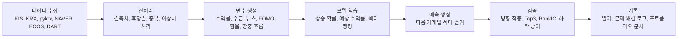

# 국내 주식 섹터 상승 예측 프로젝트

뉴스, 수급, 환율, FOMO 관심도, 장중 흐름을 수집해 다음 거래일에 상대적으로 강할 가능성이 높은 국내 주식 섹터를 예측하는 데이터 분석 프로젝트입니다.

이 프로젝트는 자동매매 시스템이 아니라, 데이터 수집부터 전처리, 변수 생성, 모델 학습, 예측, 검증, 문제 해결 기록까지 직접 설계한 포트폴리오형 머신러닝 프로젝트입니다.

## 현재 상태

| 항목 | 내용 |
| --- | --- |
| 최신 정리 기준 | 2026-07-08 장마감 데이터 |
| 문서 점검 기준 | 2026-07-08, 장마감 일기/문제 해결 로그/예측 결과 갱신 |
| 최신 수집 상태 | KIS OpenAPI 기준 240개 종목 성공, pykrx 2026-07-08까지 갱신 |
| 현재 라이브 모델 | `tomorrow_total_score + FOMO overlay` 기반 섹터 예측 |
| 최신 FOMO 반영 비중 | 0.1368 |
| 최신 장중 시장 압력 | 점수 0.861, 광범위 하락 압력 |
| 최신 국면 라우터 | broad_selloff 7개, selloff_resilience 5개 |
| 현재 운영 판단 | 라이브 모델은 유지, 서브 모델은 섀도 방식으로 추적 |
| 최신 예측 상위권 | 금융, 자동차, 반도체/전자, 조선/방산, 유통/소비 |
| 주요 리스크 | 전 섹터 약세, 최근 RankIC와 Top3 spread 약화, 최종 행동 전 섹터 회피 우선 |

2026-07-08 장마감 후 일간 파이프라인을 실행해 환율, 뉴스, 수급, pykrx, DART, KIS 장마감 스냅샷, 모델 학습, 예측 검증을 갱신했습니다. KIS 수급 overlay와 KIS 마감 스냅샷은 240개 종목 모두 성공했고, pykrx도 2026-07-08까지 갱신되었습니다. KRX 공식 API는 일부 항목만 수집되어 `partial`로 분리 기록합니다.

오늘 해결한 실행 환경 문제는 GitHub Issues에 별도 기록했습니다. README에는 프로젝트 현황과 모델 구조를 요약하고, 문제 해결 과정은 [Issues #22](https://github.com/HCG0313/part-prediction/issues/22)처럼 기간별 해결 기록으로 관리합니다.

## 프로젝트 목표

개별 종목을 바로 예측하기 전에, 시장을 섹터 단위로 먼저 이해하는 1차 모델을 만드는 것이 목표입니다.

섹터 단위 예측을 먼저 선택한 이유는 다음과 같습니다.

| 이유 | 설명 |
| --- | --- |
| 노이즈 감소 | 개별 종목은 이벤트와 급등락 영향이 커서 초기 모델 학습이 불안정합니다. |
| 시장 흐름 파악 | 다음 거래일에 어떤 산업군으로 관심과 수급이 이동하는지 먼저 확인할 수 있습니다. |
| 확장 가능성 | 섹터 예측이 안정되면 섹터 안에서 종목 후보를 고르는 2단계 모델로 확장할 수 있습니다. |

## 전체 흐름



## 데이터 구성

| 데이터 | 역할 |
| --- | --- |
| KIS OpenAPI | 장중 가격, 현재가, 섹터별 실시간 흐름 확인 |
| Naver Finance fallback | KIS 연결이 불안정할 때 대체 실시간 가격 수집 |
| KRX/pykrx | 일봉 가격, 거래대금, 종목 기본 데이터 |
| NAVER 뉴스/검색 | 뉴스 강도와 관심도 기반 FOMO 변수 생성 |
| ECOS/환율 | 원달러 환율과 거시 스트레스 변수 |
| OpenDART | 공시 이벤트 변수 |
| Kaggle/글로벌 시장 | 글로벌 시장 리스크와 보조 시장 변수 |

## 모델 구조

현재 모델은 하나의 단일 모델이 아니라 여러 판단층을 조합하는 구조입니다.

| 층 | 역할 |
| --- | --- |
| 상승 확률 모델 | 다음 거래일 섹터가 상승할 가능성을 예측합니다. |
| 예상 수익률 모델 | 상승 여부뿐 아니라 어느 정도의 수익률을 기대할 수 있는지 추정합니다. |
| 섹터 랭킹 모델 V3~V5 | 섹터 간 상대 순위를 예측합니다. 현재 V5가 중심 모델입니다. |
| FOMO overlay | 뉴스와 관심도 급증이 가격 반응으로 이어질 가능성을 보정합니다. |
| 장중 학습 상태 | 당일 장중 흐름이 다음 예측과 일치하는지 추적합니다. |
| 장중 시장 압력 | 지수와 다수 섹터가 동시에 밀릴 때 하락장 압력과 상대강도를 반영합니다. |
| 시장 국면 라우터 | 상승장, 하락장, 급락 후 반등장에 따라 모델 가중치를 다르게 적용합니다. |
| 리스크 게이트 | 최근 성능이 불안정할 때 관망이나 회피 우선으로 낮춥니다. |
| 섀도 모델 | 메인 모델을 바로 교체하지 않고 후보 모델의 성과를 따로 누적 비교합니다. |

## 2026-07-08 기준 모델 업그레이드

현재 모델은 메인 모델과 서브 모델의 가중치를 매일 추적하는 구조를 유지하면서, 실행 환경과 변수 해석성을 함께 개선했습니다.

기존에는 FOMO overlay 비중만 라이브 예측에 반영했고, 서브 모델들은 개별 리포트로만 비교했습니다. 이제는 `Hedge-style` 방식으로 후보 조합의 최근 성능을 반영해 섀도 블렌드 가중치를 계산하고, 그 가중치로 별도 예측표를 생성합니다. 다만 검증 개선폭이 충분하지 않으면 라이브 교체는 하지 않습니다.

| 항목 | 현재 적용 방식 |
| --- | --- |
| 라이브 예측 | 기존 메인 모델 유지 |
| FOMO 비중 | 최근 검증 결과에 따라 동적 반영 |
| 서브 모델 가중치 | 매일 섀도 추천값으로 계산 |
| 라이브 교체 여부 | 성능 게이트를 통과해야만 검토 |
| 신규 산출물 | `reports/model_weight_shadow_prediction.csv` |
| 변수명 정리 | 긴 원본 컬럼과 짧은 분석용 컬럼을 함께 제공 |

현재 섀도 추천 가중치는 다음과 같습니다.

| 구성요소 | 비중 |
| --- | ---: |
| base_total | 0.5500 |
| v5 | 0.1938 |
| return_model | 0.1402 |
| probability | 0.0665 |
| fomo | 0.0496 |

다만 아직 라이브 모델 교체는 하지 않았습니다. 추천 조합의 검증 점수 개선폭이 충분하지 않고, RankIC가 기존보다 낮게 나와서 안정 추적 단계로 유지했습니다.

## 최신 예측 요약

2026-07-08 장마감 후 2026-07-09를 대상으로 한 예측에서 상위 섹터는 다음과 같습니다.

| 순위 | 섹터 | 점수 | 예상 중심 수익률 | 행동 | 해석 |
| ---: | --- | ---: | ---: | --- | --- |
| 1 | 금융 | 0.356 | -0.19% | 회피 유지 | 하락장 속 상대 방어 후보 |
| 2 | 자동차 | 0.354 | -0.26% | 회피 유지 | 장중 브릿지 상위지만 수익률 중심값은 음수 |
| 3 | 반도체/전자 | 0.363 | +0.05% | 고위험 관찰 후보 | 기대수익 중심은 약하게 양수이나 변동성 큼 |
| 4 | 조선/방산 | 0.362 | +0.01% | 고위험 관찰 후보 | 낙폭이 크지만 후보 보존 |
| 5 | 유통/소비 | 0.351 | -0.33% | 회피 유지 | 방어적 상대강도 관찰 |

단, 최근 순위 품질 게이트가 `severe`이고 오늘 마감 기준 시장 압력이 강해 실제 행동 판단은 전 섹터 `회피 우선`입니다. 즉 “관심 섹터 후보”와 “바로 진입 판단”은 분리해서 봐야 합니다.

## 주요 산출물

| 파일 | 설명 |
| --- | --- |
| [tomorrow_sector_prediction.csv](reports/tomorrow_sector_prediction.csv) | 최신 다음 거래일 섹터 예측표 |
| [tomorrow_sector_prediction_compact.csv](reports/tomorrow_sector_prediction_compact.csv) | 짧은 변수명 기반 예측표 |
| [tomorrow_sector_variable_dictionary.md](reports/tomorrow_sector_variable_dictionary.md) | 짧은 변수명과 원본 변수 설명 |
| [tomorrow_sector_prediction_summary.json](reports/tomorrow_sector_prediction_summary.json) | 최신 예측 요약 |
| [model_weight_status.json](reports/model_weight_status.json) | 메인/서브 모델 가중치 상태 |
| [model_weight_shadow_prediction.csv](reports/model_weight_shadow_prediction.csv) | 섀도 블렌드 기준 예측표 |
| [model_weight_report.md](reports/model_weight_report.md) | 모델 가중치 해석 리포트 |
| [intraday_collection_summary.json](reports/intraday_collection_summary.json) | 장중 수집 상태 |
| [intraday_learning_state_summary.json](reports/intraday_learning_state_summary.json) | 장중 학습 상태 |
| [prediction_accuracy_summary.json](reports/prediction_accuracy_summary.json) | 예측 성과 요약 |

## 포트폴리오 문서

| 문서 | 설명 |
| --- | --- |
| [일일 예측 일기](docs/daily-prediction-diary.md) | 날짜별 시장 결과, 예측 비교, 다음 예측 기록 |
| [GitHub Issues](https://github.com/HCG0313/part-prediction/issues) | 오류, 원인, 해결 방법, 검증 결과를 기간별 이슈로 기록 |
| [문제 해결 로그](docs/problem-solving-log.md) | Issues 기록을 보조하는 로컬 요약 문서 |
| [모델 개발 로그](docs/model-development-log-beta.md) | 모델 구조와 업그레이드 과정 |
| [검증 결과](docs/results.md) | 최신 성능 지표와 포트폴리오 관점의 해석 |
| [포트폴리오 이슈 계획](docs/github-portfolio-issue-plan.md) | GitHub 포트폴리오 정리 방향 |
| [노트북](notebooks/part_prediction_portfolio_pipeline.ipynb) | 수집부터 예측까지 전체 흐름을 설명하는 노트북 |

## 현재 남은 과제

| 과제 | 방향 |
| --- | --- |
| 최근 RankIC 약화 | 메인 모델 교체보다 섀도 모델 성과 누적 비교 |
| Top3 적중률 불안정 | 순위 모델과 예상 수익률 모델의 조합 검증 강화 |
| KIS 연결 변동성 | KIS와 Naver 수집 파일을 분리하고 active source를 명확히 기록 |
| 문서 인코딩 문제 | 핵심 README와 일기, 문제 해결 문서를 UTF-8 기준으로 정리 |
| 개별 종목 확장 | 섹터 예측 안정화 후 섹터 내부 후보 종목 모델로 확장 |

## 실행 예시

```powershell
cd "C:\Users\mobu3\OneDrive\바탕 화면\금융파일\fx_fomo_stock_model"
powershell -ExecutionPolicy Bypass -File .\scripts\run_daily_collection.ps1
```

모델 가중치 상태만 갱신하려면 다음을 실행합니다.

```powershell
python .\scripts\update_model_weight_status.py
```

## 주의

이 프로젝트의 예측 결과는 투자 추천이 아닙니다. 목표는 데이터를 기반으로 시장 흐름을 분석하고, 예측 모델의 개선 과정을 검증 가능한 형태로 기록하는 것입니다.