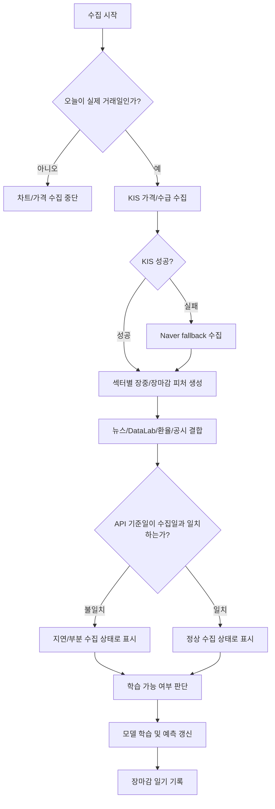
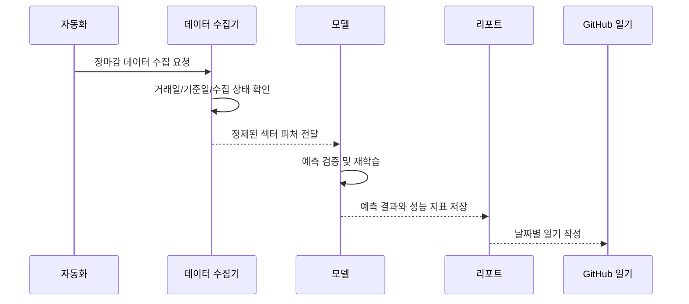

# 데이터 파이프라인

## 목적

이 프로젝트의 데이터 수집 목적은 단순히 많은 데이터를 모으는 것이 아니라, 뉴스/FOMO 기대효과가 실제 다음 거래일 섹터 반응으로 이어지는지 검증할 수 있는 구조를 만드는 것입니다.

## 주요 수집원

| 수집원 | 사용 목적 | 상태 관리 |
| --- | --- | --- |
| KIS | 실시간/장마감 가격, 투자자 수급, 섹터 스냅샷 | 실패 시 Naver fallback과 수집 상태 기록 |
| pykrx/KRX | 공식 또는 보조 가격 검증 데이터 | 기준일 지연 여부 확인 |
| NAVER 뉴스 | 섹터별 뉴스 노출과 키워드 강도 | 수집 건수와 검색어별 결과 기록 |
| NAVER DataLab | 검색 관심도와 FOMO 보조 신호 | API 상태와 기준 기간 기록 |
| ECOS | 환율 데이터 | 실제 기준일, 캐시 사용 여부, 성공 상태 기록 |
| OpenDART | 기업 공시와 이벤트성 재료 | 기업/공시/일별 피처 행 수 기록 |
| Kaggle/Yahoo | 글로벌 시장 보강 데이터 | 국내장 해석의 보조 변수로 사용 |

## 수집 흐름

## 거래일 제어

데이터 수집 단계에서 가장 중요한 제어 변수는 거래일 상태입니다. 장이 열리지 않는 날에 API가 이전 거래일 데이터를 다시 반환하면, 모델은 같은 가격 데이터를 다른 날짜의 데이터로 중복 학습할 수 있습니다.

현재 구조에서는 다음 상태를 구분합니다.

| 상태 | 의미 | 처리 |
| --- | --- | --- |
| `trading_day` | 실제 거래일 | 가격/뉴스/수급 수집 및 학습 가능 |
| `holiday` | 공휴일 또는 휴장일 | 차트 수집 중단, 뉴스/FOMO만 후보 기록 가능 |
| `weekend_gap` | 다음 거래일 사이에 주말이 있음 | 예측 대상일을 다음 실제 거래일로 조정 |
| `partial` | 일부 API 기준일 지연 | 보조 데이터로만 사용하거나 검증에서 제외 |

## 장마감 자동화 흐름

## 포트폴리오에서 보여줄 포인트

- 단순 API 호출이 아니라, API 기준일과 실제 거래일을 비교해 데이터 신뢰성을 검증했습니다.
- KIS 실패 시 Naver fallback을 사용하고, 데이터 출처를 명확히 표시하는 구조를 만들었습니다.
- 휴장일/공휴일 중복 수집 문제를 모델 성능 문제로 연결해 분석했습니다.
- 장마감 후 매일 예측과 실제 결과를 비교해 데이터 수집이 모델 개선으로 이어지도록 설계했습니다.
