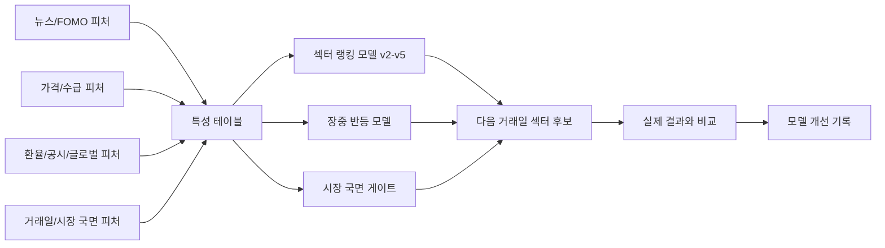

# 모델 구조

## 현재 모델의 성격

현재 프로젝트의 중심 모델은 딥러닝 모델이 아니라 머신러닝 기반 섹터 랭킹 모델입니다. 여기에 규칙 기반 시장 국면 게이트와 장중 반등 신호 모델을 결합해 최종 판단을 만듭니다.

## 전체 구조

## 주요 모델 구성

| 구성 | 역할 |
| --- | --- |
| 섹터 랭킹 모델 v2-v5 | 다음 거래일 섹터별 기대 수익률과 상승 가능성을 계산 |
| 시장 국면 게이트 | `risk_on`, `risk_off`, `capitulation`, `mixed_rotation`에 따라 진입/회피 기준 조정 |
| 장중 반등 신호 모델 | 장중 가격 회복, breadth 변화, 거래대금 순위를 이용해 단기 반등 가능성 확인 |
| 일일 검증 루프 | 전일 예측과 실제 장마감 결과를 비교해 오차 원인을 기록 |

## 입력 변수

| 그룹 | 예시 |
| --- | --- |
| 뉴스/FOMO | 뉴스 건수, 키워드 강도, 검색 관심도, FOMO 기대효과 |
| 가격 | 섹터 수익률, 장중 수익률, 고점/저점 회복률, 전일 대비 변화 |
| 시장 폭 | 상승 종목 비율, breadth delta, 섹터 내 확산 정도 |
| 수급 | 투자자 수급, 거래대금 순위, 대형주 쏠림 |
| 거시/이벤트 | 환율, 글로벌 시장, 공시 이벤트 |
| 캘린더 | 거래일 여부, 휴장일, 주말 gap, 기준일 지연 상태 |

## 출력 결과

모델은 단순히 "오른다/내린다"만 출력하지 않고 다음과 같은 판단을 함께 남깁니다.

| 출력 | 의미 |
| --- | --- |
| 예측 수익률 | 다음 거래일 섹터별 기대 수익률 |
| 상승 확률 | 섹터별 상승 가능성 |
| 시장 국면 | 전체 시장이 위험 선호인지 회피 국면인지 |
| 최종 행동 | 핵심 관찰, 보조 관찰, 관망, 회피 우선 |
| 오차 기록 | 예측과 실제 결과가 어긋난 이유 |

## 현재 성능 해석

2026-06-11 장마감 기준 누적 방향 정확도는 48.4%입니다. 숫자만 보면 아직 낮지만, 이 프로젝트는 정확도 하나보다 다음 두 가지를 더 중요하게 봅니다.

1. 어떤 국면에서 모델이 틀리는지 분리한다.
2. 틀린 이유를 다음 피처와 게이트 개선으로 연결한다.

최근 결과를 보면 모델은 급락장에서 회피 게이트를 잡는 능력은 개선되고 있지만, 급락 후 강한 반등장에서는 실제 주도 섹터를 늦게 잡는 문제가 남아 있습니다.

## 현재 한계

- 장중 반등 모델은 정확도는 높게 보이지만 positive rate가 낮아 precision/recall이 아직 약합니다.
- 뉴스/FOMO 신호가 가격 반응보다 먼저 움직일 때와 과열 신호로 변할 때를 더 잘 구분해야 합니다.
- 전일 약세 페널티를 너무 강하게 두면 다음 날 주도권 교체를 놓칠 수 있습니다.
- 대형주 중심 급등과 섹터 전체 확산을 분리해서 평가해야 합니다.
